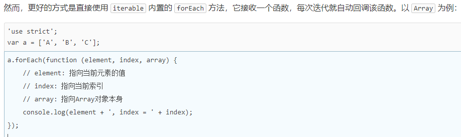
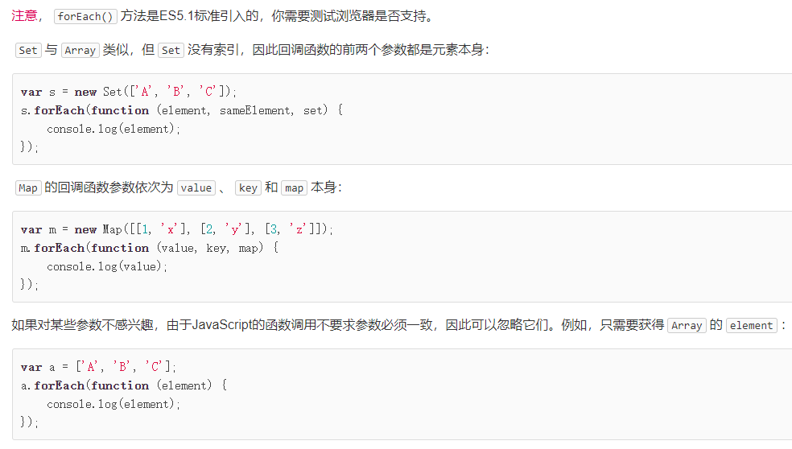

[https://www.liaoxuefeng.com/wiki/1022910821149312](https://www.liaoxuefeng.com/wiki/1022910821149312)


## 1. 背景

因为网景开发了JavaScript，一年后微软又模仿JavaScript开发了JScript，为了让JavaScript成为全球标准，几个公司联合ECMA（European Computer Manufacturers Association）组织定制了JavaScript语言的标准，被称为ECMAScript标准。

不过大多数时候，我们还是用JavaScript这个词。如果你遇到ECMAScript这个词，简单把它替换为JavaScript就行了。

由于JavaScript的标准——ECMAScript在不断发展，最新版ECMAScript 6标准（简称ES6）已经在2015年6月正式发布了，所以，讲到JavaScript的版本，实际上就是说它实现了ECMAScript标准的哪个版本。由于浏览器在发布时就确定了JavaScript的版本，加上很多用户还在使用IE6这种古老的浏览器，这就导致你在写JavaScript的时候，要照顾一下老用户，不能一上来就用最新的ES6标准写，否则，老用户的浏览器是无法运行新版本的JavaScript代码的。


## 2. 快速入门

不管哪种方式都需要以 HTML 文件为支撑，并且都需要**写入到 HTML 中 head 标签下的 script 标签**中。script 标签有两种形式：

```
<script>
// 这里直接写 js
</script>

<script src="/static/js/abc.js"></script>

```


### 2.1. 基本语法

1. 分号可加可不加，但建议都加；
2. 严格区分大小写；


### 2.2. 数据类型


#### 2.2.1. Number

不区分整数和浮点数，统一用Number表示
整数最大范围不是±263，而是±253
可以直接做四则运算，规则和数学一致
用十六进制表示整数比较方便

```
1.2345e3; // 科学计数法表示1.2345x1000，等同于1234.5
NaN; // NaN表示Not a Number，当无法计算结果时用NaN表示
Infinity; // Infinity表示无限大，当数值超过了JavaScript的Number所能表示的最大值时，就表示为Infinity

```


#### 2.2.2. 字符串
以单引号'或双引号"括起来的任意文本
转义字符\可以转义很多字符
用\u####表示一个Unicode字符，

```
'\u4e2d\u6587'; // 完全等同于 '中文'

```
多行字符串的表示方法，用反引号`...`表示
ES6新增了一种模板字符串，表示方法和上面的多行字符串一样，但是它会自动替换字符串中的变量：

```
let name = '小明';
let age = 20;
let message = `你好, ${name}, 你今年${age}岁了!`;
alert(message);

```
toUpperCase()把一个字符串全部变为大写
toLowerCase()把一个字符串全部变为小写
indexOf()会搜索指定字符串出现的位置
substring()返回指定索引区间的子串


#### 2.2.3. 布尔值

布尔值和布尔代数的表示完全一致，一个布尔值只有true、false两种值，要么是true，要么是false，可以直接用true、false表示布尔值，也可以通过布尔运算计算出来
说明条件判断的顺序非常重要
把null、undefined、0、NaN和空字符串''视为false，其他值一概视为true
&&运算是与运算
||运算是或运算
!运算是非运算


#### 2.2.4. 比较运算符

第一种是==比较，它会自动转换数据类型再比较，很多时候，会得到非常诡异的结果；
第二种是===比较，它不会自动转换数据类型，如果数据类型不一致，返回false，如果一致，再比较。
由于JavaScript这个设计缺陷，_不要_使用==比较，始终坚持使用===比较。

另一个例外是NaN这个特殊的Number与所有其他值都不相等，包括它自己：

```
NaN === NaN; // false

```
唯一能判断NaN的方法是通过isNaN()函数：


最后要注意浮点数的相等比较；浮点数在运算过程中会产生误差，因为计算机无法精确表示无限循环小数。要比较两个浮点数是否相等，只能计算它们之差的绝对值，看是否小于某个阈值：


#### 2.2.5. Bigint

精确表示比253还大的整数，可以使用内置的BigInt类型，它的表示方法是在整数后加一个n，例如9223372036854775808n，也可以使用BigInt()把Number和字符串转换成BigInt：
使用BigInt可以正常进行加减乘除等运算，结果仍然是一个BigInt，但不能把一个BigInt和一个Number放在一起运算：


#### 2.2.6. null 和 undefined

null表示一个“空”的值；还有一个和null类似的undefined，它表示“未定义”。
区分两者的意义不大。大多数情况下，我们都应该用null。undefined仅仅在判断函数参数是否传递的情况下有用。


#### 2.2.7. 数组

数组可以包括任意数据类型，创建数组的两种方法：

```
[1, 2, 3.14, 'Hello', null, true];
new Array(1, 2, 3); // 创建了数组[1, 2, 3]

```
出于代码的可读性考虑，强烈建议直接使用[]。索引的起始值为0
要取得Array的长度，直接访问length属性
可以通过indexOf()来搜索一个指定的元素的位置
slice()就是对应String的substring()版本，它截取Array的部分元素，然后返回一个新的Array
注意到slice()的起止参数包括开始索引，不包括结束索引。如果不给slice()传递任何参数，它就会从头到尾截取所有元素。利用这一点，我们可以很容易地复制一个Array

push()向Array的末尾添加若干元素，pop()则把Array的最后一个元素删除掉

如果要往Array的头部添加若干元素，使用unshift()方法，shift()方法则把Array的第一个元素删掉

sort()可以对当前Array进行排序，它会直接修改当前Array的元素位置，直接调用时，按照默认顺序排序

reverse()把整个Array的元素给调个个，也就是反转	
splice()方法是修改Array的“万能方法”，它可以从指定的索引开始删除若干元素，然后再从该位置添加若干元素

concat()方法把当前的Array和另一个Array连接起来，并返回一个新的Array；concat()方法可以接收任意个元素和Array，并且自动把Array拆开，然后全部添加到新的Array里

join()方法是一个非常实用的方法，它把当前Array的每个元素都用指定的字符串连接起来，然后返回连接后的字符串；如果Array的元素不是字符串，将自动转换为字符串后再连接

如果数组的某个元素又是一个Array，则可以形成多维数组


#### 2.2.8. 对象

对象是一组由键-值组成的无序集合；键都是字符串类型，值可以是任意数据类型，使用方式： 对象变量.属性名
访问不存在的属性不报错，而是返回undefined
访问属性是通过.操作符完成的，但这要求属性名必须是一个有效的变量名。如果属性名包含特殊字符，就必须用''括起来：

```
var xiaohong = {
    name: '小红',
    'middle-school': 'No.1 Middle School'
};

```
xiaohong的属性名middle-school不是一个有效的变量，就需要用''括起来。访问这个属性也无法使用.操作符，必须用['xxx']来访问：

```
xiaohong['middle-school']; // 'No.1 Middle School'
xiaohong['name']; // '小红'
xiaohong.name; // '小红'

```
也可以用xiaohong['name']来访问xiaohong的name属性，不过xiaohong.name的写法更简洁。我们在编写JavaScript代码的时候，属性名尽量使用标准的变量名，这样就可以直接通过object.prop的形式访问一个属性了。
如果我们要检测xiaoming是否拥有某一属性，可以用in操作符：

```
var xiaoming = {
    name: '小明',
    birth: 1990,
    school: 'No.1 Middle School',
    height: 1.70,
    weight: 65,
    score: null
};
'name' in xiaoming; // true
'grade' in xiaoming; // false

```
不过要小心，如果in判断一个属性存在，这个属性不一定是xiaoming的，它可能是xiaoming继承得到的：

```
'toString' in xiaoming; // true

```
因为toString定义在object对象中，而所有对象最终都会在原型链上指向object，所以xiaoming也拥有toString属性。
要判断一个属性是否是xiaoming自身拥有的，而不是继承得到的，可以用hasOwnProperty()方法：

```
var xiaoming = {
    name: '小明'
};
xiaoming.hasOwnProperty('name'); // true
xiaoming.hasOwnProperty('toString'); // false

```
实际上Number或者其他数据类型作为键也是非常合理的；为了解决这个问题，最新的ES6规范引入了新的数据类型Map
Map是一组键值对的结构，具有极快的查找速度；
初始化Map需要一个二维数组，或者直接初始化一个空Map

```
var m = new Map(); // 空Map
m.set('Adam', 67); // 添加新的key-value
m.set('Bob', 59);
m.has('Adam'); // 是否存在key 'Adam': true
m.get('Adam'); // 67
m.delete('Adam'); // 删除key 'Adam'
m.get('Adam'); // undefined

```
Set和Map类似，也是一组key的集合，但不存储value。由于key不能重复，所以，在Set中，没有重复的key
遍历Array可以采用下标循环，遍历Map和Set就无法使用下标。为了统一集合类型，ES6标准引入了新的iterable类型，Array、Map和Set都属于iterable类型。
具有iterable类型的集合可以通过新的for ... of循环来遍历。

```
var a = ['A', 'B', 'C'];
var s = new Set(['A', 'B', 'C']);
var m = new Map([[1, 'x'], [2, 'y'], [3, 'z']]);
for (var x of a) { // 遍历Array
    console.log(x);
}
for (var x of s) { // 遍历Set
    console.log(x);
}
for (var x of m) { // 遍历Map
    console.log(x[0] + '=' + x[1]);
}

```
for ... in循环由于历史遗留问题，它遍历的实际上是对象的属性名称。一个Array数组实际上也是一个对象，它的每个元素的索引被视为一个属性。
当我们手动给Array对象添加了额外的属性后，for ... in循环将带来意想不到的意外效果：

```
var a = ['A', 'B', 'C'];
a.name = 'Hello';
for (var x in a) {
    console.log(x); // '0', '1', '2', 'name'
}

```
for ... in循环将把name包括在内，但Array的length属性却不包括在内。
for ... of循环则完全修复了这些问题，它只循环集合本身的元素：

```
var a = ['A', 'B', 'C'];
a.name = 'Hello';
for (var x of a) {
    console.log(x); // 'A', 'B', 'C'
}

```





#### 2.2.9. 变量

变量名是大小写英文、数字、$和_的组合，且不能用数字开头，当然也不能是关键字；
可以把任意数据类型赋值给变量，同一个变量可以反复赋值，而且可以是不同类型的变量，但是要注意只能用var申明一次


#### 2.2.10. strict 模式

如果一个变量没有通过var申明就被使用，那么该变量就自动被申明为全局变量；
启用strict模式的方法是在JavaScript代码的第一行写上： 

```
'use strict';

```
不用var申明的变量会被视为全局变量，为了避免这一缺陷，所有的JavaScript代码都应该使用strict模式。


## 3. 函数

定义

调用

参数

rest 函数


变量作用域与解构赋值

- 局部作用域
   - 块作用域
- 全局作用域
- 命名空间
- 常量
- 解构


方法

- 对象上绑定的函数就是方法
- this 和 that
- apply


## 4. node


### 4.1. 背景

1. 微软解散了 IE 浏览器团队，谷歌的团队迅速发展，V8 登场；
2. Ryan Dahl 本身是 C/Ｃ++的高性能 Web 工程师，但考察了很多高级语言，发现很多语言虽然同时提供了同步IO和异步IO，但是开发人员一旦用了同步IO，他们就再也懒得写异步IO了，所以，最终，Ryan瞄向了JavaScript；
3. 选定语言后，还要有运行时引擎，因为V8就是开源的JavaScript引擎，直接拿来主义；
4. 于是 09 年正式推出基于JavaScript语言和V8引擎的开源Web服务器项目，命名为Node.js；
5. 虽然JavaScript语言本身是完善的函数式语言，在前端开发时，开发人员往往写得比较随意，让人感觉JavaScript就是个“玩具语言”。但是，在Node环境下，通过模块化的JavaScript代码，加上函数式编程，并且无需考虑浏览器兼容性问题，直接使用最新的ECMAScript 6标准，可以完全满足工程上的需求
6. 借助JavaScript天生的事件驱动机制加V8高性能引擎，使编写高性能Web服务轻而易举
7. io.js将首先添加新的特性，如果大家测试用得爽，就把新特性加入Node.js


版本号三部分组成：主版本号.次版本号.修订版本号

修改版本号时，需要遵守约定：

主版本号：修改的代码对功能产生影响，增加主版本号，并重置次版本号和修订版本号
次版本号：修改代码新增了功能，但没有删除和修改已有的功能，增加次版本号，重置修订版本号
修订版本号：修改代码修复bug，没有新增和删除任何功能，应该增加修订版本号
————————————————

                        
原文链接：[https://blog.csdn.net/HuoYiHengYuan/article/details/100945249](https://blog.csdn.net/HuoYiHengYuan/article/details/100945249)

- 波浪号（tilde）+指定版本：比如 ~1.2.2 ，表示安装 1.2.x 的最新版本（不低于1.2.2），但是不安装 1.3.x，也就是说安装时不改变大版本号和次要版本号。
- 插入号（caret）+指定版本：比如 ˆ1.2.2，表示安装 1.x.x 的最新版本（不低于 1.2.2），但是不安装 2.x.x，也就是说安装时不改变大版本号。需要注意的是，如果大版本号为 0，则插入号的行为与波浪号相同，这是因为此时处于开发阶段，即使是次要版本号变动，也可能带来程序的不兼容。
- latest：安装最新版本。

package.json 文件配置说明
name：项目/模块名称，长度必须小于等于214个字符，不能以"."(点)或者"_"(下划线)开头，不能包含大写字母。
version：项目版本。
author：项目开发者，它的值是你在https://npmjs.org网站的有效账户名，遵循“账户名<邮件>”的规则。
description：项目描述，是一个字符串。它可以帮助人们在使用npm search时找到这个包。
keywords：项目关键字，是一个字符串数组。它可以帮助人们在使用npm search时找到这个包。
private：是否私有，设置为 true 时，npm 拒绝发布。
license：软件授权条款，让用户知道他们的使用权利和限制。
bugs：bug 提交地址。
contributors：项目贡献者 。
repository：项目仓库地址。
homepage：项目包的官网 URL。
dependencies：生产环境下，项目运行所需依赖。
devDependencies：开发环境下，项目所需依赖。
scripts：执行 npm 脚本命令简写，比如 “start”: “react-scripts start”, 执行 npm start 就是运行 “react-scripts start”。
bin：内部命令对应的可执行文件的路径。
main：项目默认执行文件，比如 require(‘webpack’)；就会默认加载 lib 目录下的 webpack.js 文件，如果没有设置，则默认加载项目跟目录下的 index.js 文件。
module：是以 ES Module(也就是 ES6)模块化方式进行加载，因为早期没有 ES6 模块化方案时，都是遵循 CommonJS 规范，而 CommonJS 规范的包是以 main 的方式表示入口文件的，为了区分就新增了 module 方式，但是 ES6 模块化方案效率更高，所以会优先查看是否有 module 字段，没有才使用 main 字段。
eslintConfig：EsLint 检查文件配置，自动读取验证。
engines：项目运行的平台。
browserslist：供浏览器使用的版本列表。
style：供浏览器使用时，样式文件所在的位置；样式文件打包工具parcelify，通过它知道样式文件的打包位置。
files：被项目包含的文件名数组。

package.json 与 package-lock.json 介绍

1. package.json 相当于 Java 中的 pom 文件，用来引入 node 项目中所依赖的 js 包；里面包含了 dependencies 和 devDependencies 等节点；


1. 当我们使用 node 进行项目开发时，我们会使用 npm init 命令生成我们项目的骨架。
2. 如果我们想要在项目中引入某个 js 包，那么我们可以使用 npm install pakcagename，npm 会自动把依赖信息放入项目根目录下的 package.json 中，同时会把 js 包下载到 node_module 中；
3. 由于 js 包的版本命名规范限制和我们使用 js 包时写的版本号，导致今天使用的版本可 abc，到了明天下载下来的版本可能就变了；因此，node 给我们引入 packag-lock.json 文件，用来锁定当前项目所依赖的 js 包的版本，这样就保证了版本的一致性；
4. package-lock.json 文件存在后，npm 执行 install 命令后会首先根据这个文件来下载所需要的依赖包，因此如果修改了 package.json 文件中的版本信息，再次运行项目时就会出现版本冲突的问题，解决思路有两个：
   1. 重新生成 package-lock.json 文件；
   2. 【已验证，推荐使用这种方式】直接修改 package-lock.json 文件中的版本号；


1. [package.json和package-lock.json介绍](https://blog.csdn.net/drawlessonsfrom/article/details/121616793)
2. [深度解析package-lock.json作用](https://zhuanlan.zhihu.com/p/463697890)
3. [浅析nodejs中的package.json和package-lock.json作用 ](https://www.cnblogs.com/goloving/p/14602743.html)
4. [如何重新生成package-lock.json文件？](https://www.volcengine.com/theme/4227822-R-7-1)
