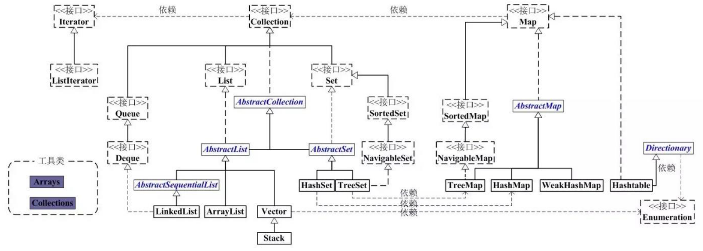
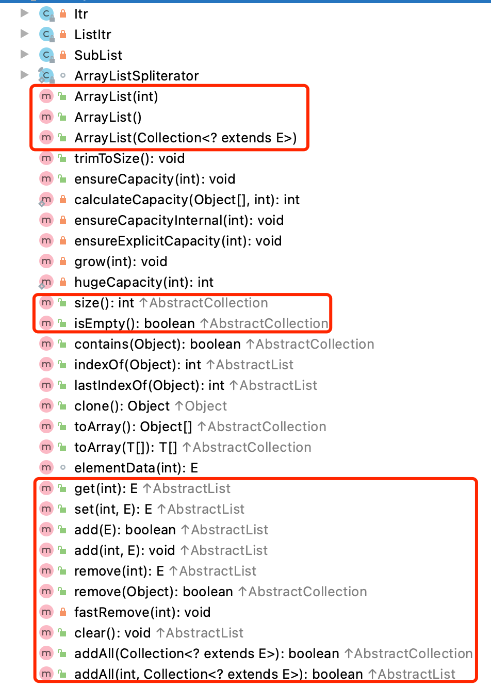
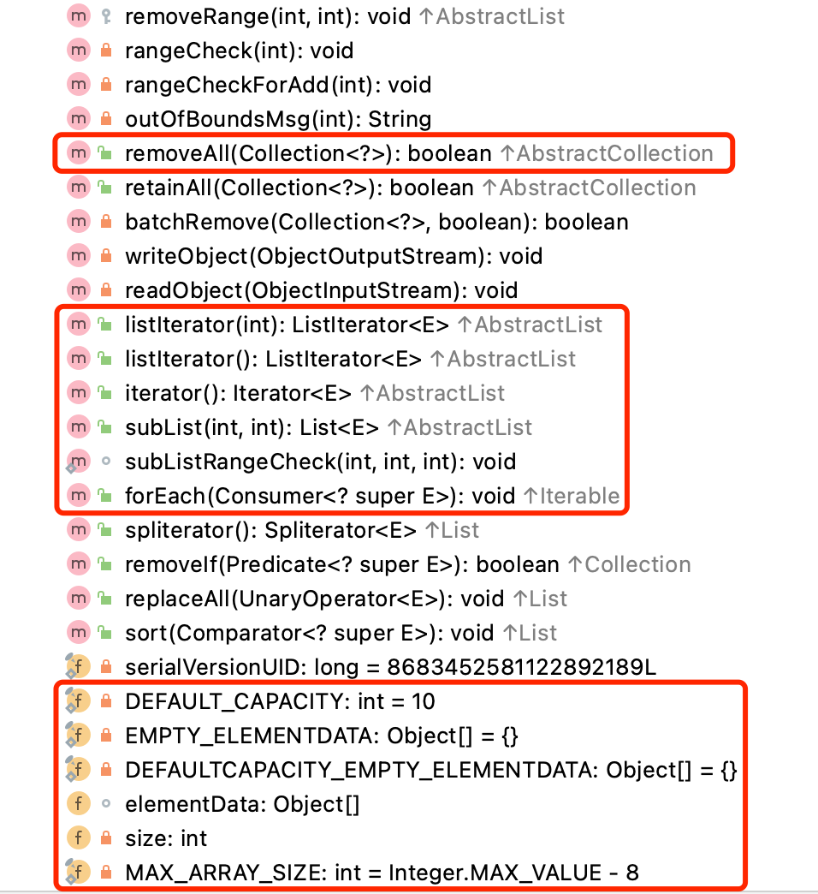
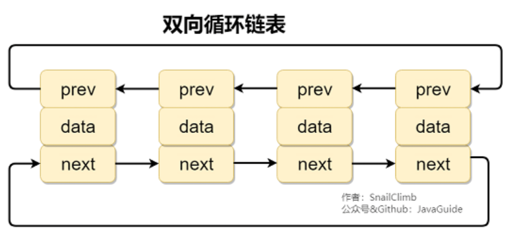
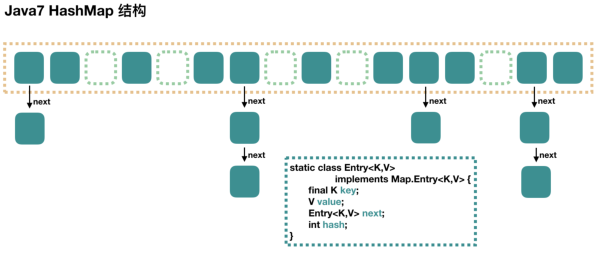
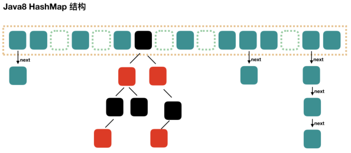
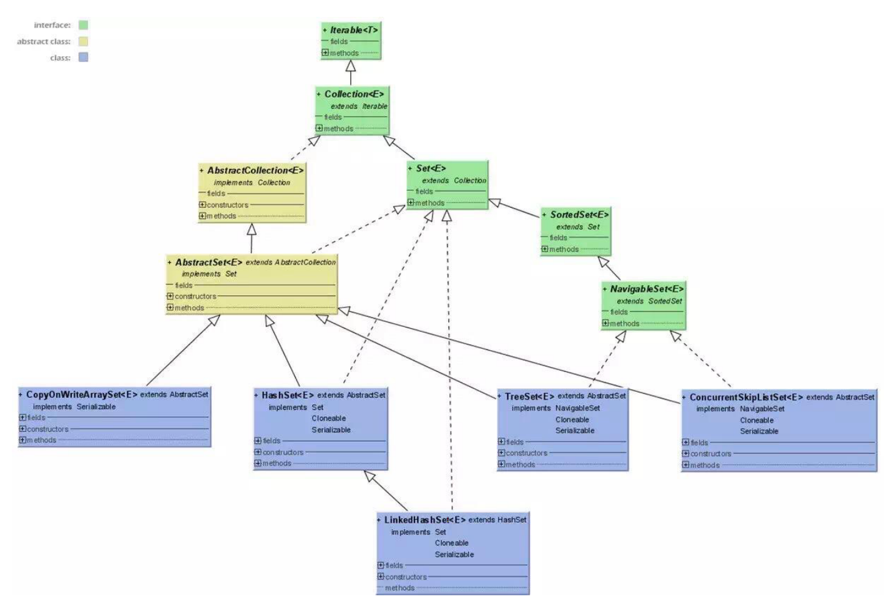

> 集合相关的内容多从数据结构的角度进行面试。而数据结构包括两部分的内容，存储和算法。存储上又分为逻辑结构和物理结构。算法就是操作存储在硬盘或内存中的数据的过程或步骤。
>  
> `因此我们在回答集合方面的面试题时，要从数据结构的角度来回答。`

分成单列集合和双列集合，分别对应两个顶级接口： Collection 和 Map。

Collection中有两个重要接口：

- List： 允许元素重复，允许保存多个Null元素，并且有序（存入顺序与实际存储顺序一致），具体实现有 ArrayList 、 LinkedList 、 Vector ；
- Set： 不允许元素重复，只允许保存一个Null，并且是无序的（存入顺序与实际存储顺序不一致），具体实现有 HashSet 、 LinkedHashset 、 TreeSet ；

Map下面主要有HashMap、Hashtable、TreeMap、LinkedHashMap等实现；

还有两个遍历器。

## List

允许元素重复。

### ArrayList

1. 数组组成，内存规整，可以快速读取和修改，增加和删除需要进行复制，速度较慢；
2. 默认10，可以指定容量（初始化容量+另一个list进行初始化）；
3. 缩扩容原理（扩容为原来的1.5倍，使用复制的方式进行缩容或者扩容）；
4. 不支持同步，但是可以Collections.synchronizedList(aList)变成同步；
5. Fast-Fail机制，使用modNum标识版本，避免读写过程中的并发问题；
6. 实现了Random接口，可以实现随机访问；
7. 适合随机读写和遍历；

### Vector

1. 也是数组实现，但是支持同步，同步机制是通过重量级锁Synchronize实现的，性能较差，目前已经被jdk废弃；
2. 扩容为原来的2倍；

### LinkedList

1. 双向链表，内存不规整，增删快，查改慢；
2. 缩扩容只需要修改链表的指向即可；
3. 不支持同步；
4. 不支持快速随机读写；

## Set

不允许元素重复。

### HashSet

1. 保存的内容为不重复的内容；本质上是数组+链表的方式进行存储的；
2. 在添加元素时，会先计算元素的hashcode值，然后去数组上找到hash桶的位置，之后再使用元素的值一一比对同一个hash桶上的其他元素，如果相等就不做任何操作，如果没有相等的，就顺延插入；
3. 由于添加元素的操作的限制，因此HashSet的泛型参数要进行相等判断，即需要实现自定义的判断对象相等的hashcode方法和equals方法；并且由于添加元素的操作原理可知，添加的顺序与实际保存到内存中的顺序并不一致；

### TreeSet

1. 数据结构为二叉树，可以对每一个添加的元素进行排序；
2. 保存的内容为有序的内容，因此自定义的泛型参数需要实现Comparable接口，并覆写compareTo()方法，并且要返回负数、零或正整数；

### LinkedHashset

1. 是基于HashSet和LinkedHashMap实现的；保存数据的方式与LinkedHashMap一致，操作数据的方式与HashSet一致；

## Map

### HashMap

1. 三点变化

- 数据结构发生变化，原来的数组+链表，变成数组+链表或红黑树；
- entry变成node，头插法变成尾插法，解决并发写时的循环链表问题；
- put方法发生变化，多了一个判断链表长度的条件，链表长度>8，就转化为红黑树，node个数<6就退化为链表；

2. 构造方法中的三个参数：初始化容量（默认16），负载因子（默认0.75），扩容阈值（初始化容量*负载因子，默认12）
3. put方法： 先判断是否需要执行扩容，如果不需要就计算key的hashcode，然后找到hash桶的坐标，也就是数组的索引，之后再把元素插到链表或者红黑树的节点上；
4. get方法： 先计算hash桶坐标，之后再遍历链表或红黑树来判断值是否相等；
5. 扩容机制： 扩容为原来的两倍；
6. 同步机制： 不支持同步，但是可以使用Collections.synchronizedMap(hashMap)进行同步；

### Hashtable

1. 存储上，既不支持null-key，又不支持null-value；扩容时，扩容为2n+1；
2. 迭代器是Enumerator，不支持fast-failed机制；
3. 继承自Dictionary类；
4. 是线程安全的，但是同步效率很低，同步时多用ConcurrentHashMap，而不是Hashtable

### TreeMap

1. 通过红黑树实现的有序键值对集合，是通过实现了SortedMap接口，来使其具有根据key进行排序的能力；
2. 在使用时，传入的key要实现Comparable接口或构造时传入自定义的Comparator；

### LinkedHashMap

1. 是根据插入顺序排序的键值对集合，即内存中的排列顺序就是插入的顺序；
2. 也可以在构造时传入参数，使其按照访问次数排序；
3. 是HashMap的一个子类，具有和HashMap一样的查询效率；

### WeakHashMap

1. 其中的Entry继承自弱引用WeakReference，用来实现类似缓存的功能；

集合，有些人也称容器，研究这块内容的时候，可以类比研究某一个框架的方法来研究之。

## 1. 概述

先来看一下jdk中集合的类图：

先根据集合大图来看下集合中都包括哪些内容：

- 集合有两个顶级接口 
   - Collection 
      - 保存单列元素数据
      - 包含两个子接口 
         - List： 保存的元素顺序为`有序`
         - Set： 保存的元素顺序为`无序`
      - 具体实现类 
         - List接口有： `ArrayList`、 `LinkedList`、 `Vector`（以及Vector的子类 `Stack`）
         - Set接口有： `HashSet`、 `TreeSet`
   - Map 
      - 保存双列元素数据， 即保存(key, value)键值对形式的数据元素
      - 具体实现类： `HashMap` 、 `TreeMap` 、 `WeakHashMap` 、 `Hashtable`

## 2. 基本原理

### 2.1. List

**list具有有序性（存入的顺序与存储的顺序一致），不具备唯一性，元素可以重复，可以插入多个 null 元素，并且每一元素都有索引下标。它包含了 ArrayList 、 Vector 、 LinkedList 三个最重要的实现类。**

#### 2.1.1. ArrayList

- `底层数据结构` 
   - Object[] 数组（Java中的数组是引用数据类型，它指向jvm的堆内存中的存放数组元素的开始位置）；
- `默认容量` 
   - ArrayList默认最小容量是10，默认最大容量是 MAX_ARRAY_SIZE = Integer.MAX_VALUE - 8
- `初始化原理` 
   - 如果使用无参构造方法，就初始化为 Object[10] ，数组内元素为空，即初始化为 长度为10的空对象数组
   - 如果初始化时一开始指定了容量，则容量为指定的大小 bList = new ArrayList<>(25)， 则 bList 的大小为25
   - 如果通过集合初始化，则容量为集合的大小，如 bList = new ArrayList<>(aList)，其中 aList 的大小为16，则 bList 的大小为16
- `扩容原理` 
   - 每次扩容为原来的1.5倍，如果新增后超过这个容量，则容量为新增后所需的最小容量，如 预计本次扩容后容量为30，但是新增的数据容量加上之前的数据容量为45，超过预计扩容后的30，则扩容后的实际容量45
   - 如果增加0.5倍后的新容量超过限制的容量 （也称默认最大容量，即 Integer.MAX_VALUE - 8），则用所需的最小容量与限制的容量进行判断，超过则指定为Integer的最大值，否则指定为限制容量大小
   - 最后通过数组的复制将原数据复制到一个更大(新的容量大小)的数组
- `扩容效率`： 还是很高的 
   - 1千需要分配 11次
   - 1万一级需要分配17次
   - 10万 需要分配23次
   - 100万需要分配28次
- `缩容原理` 
   - 使用System.copyArrays()方法
- `常用方法` 
   - 方法大图

- 增 
   - add(E)： 添加一个元素
   - add(int, E)： 在int位置添加一个元素
   - addAll(Collection<?>)： 往list中插入集合
   - addAll(int, Collection<?>)： 在int位置插入一个集合
   - 删 
      - clear()： 删除全部， 底层是把使用for遍历数组，把每一个元素都置为空
      - remove(int)： 删除某下标元素
      - remove(Object)： 删除某元素
      - removeRange(int, int)： 删除连续的一组元素
      - removeAll(Collection<?>)： 传入一个List中包含的集合，删除它
   - 改 
      - set(int, E)： 把int位置上的元素设置为E
   - 查 
      - get(int)： 根据下标获取元素
   - 遍历 
      - for 循环遍历，基于计数器。在集合外部维护一个计数器，然后依次读取每一个位置的元素，当读取到最后一个元素后停止。
      - Iterator 迭代器遍历。 Iterator 是面向对象的一个设计模式，目的是屏蔽不同数据集合的特点，统一遍历集合的接口。Java 在 Collections 中支持了 Iterator 模式。
      - foreach 循环遍历。foreach 内部也是采用了 Iterator 的方式实现，使用时不需要显式声明 Iterator 或计数器。优点是代码简洁，不易出错；缺点是只能做简单的遍历，不能在遍历过程中操作数据集合，例如删除、替换。
      - ListIterator 遍历。 list 和 set 都实现了 Iterator 接口，但是 list 又实现了 ListIterator 接口。
- `由源码得出的其它特点` 
   - `内存特点`： 内存规整
   - `操作方法特点`： 增删需要数组拷贝，效率低；修改和查询较快，效率高；
   - `同步特点`： 不支持线程同步，即属于非线程安全的类。但是可以使用 `**Collections.synchronizedList(aList)**` 把ArrayList变成线程安全类，或者直接使用 `**CopyOnWriteArrayList**` 进行线程同步
   - `Fail-Fast机制`：使用modNum来来控制，假设存在两个线程（线程1、线程2），线程1通过Iterator在遍历集合A中的元素，在某个时候线程2修改了集合A的结构（是结构上面的修改，而不是简单的修改集合元素的内容），那么这个时候程序就会抛出 ConcurrentModificationException 异常，从而产生fail-fast机制；这种机制是早期为了平衡集合性能和线程同步而引入的，目的就是为了弥补集合中不支持线程同步的问题
- `最佳实践`： 
   - 如果知道集合元素个数，建议使用带参构造方法【ArrayList(int)】进行初始化，这样避免多次扩容缩容影响性能；
   - 因为实现了 RandomAccess 接口，所以建议优先使用 for 遍历元素， 时间复杂度为 O(1)
   - 适合随机查询或遍历，插入和删除较慢；

#### 2.1.2. LinkedList

这里通过类比来学习， LinkedList 与 ArrayList 的区别：

- `存储结构`： ArrayList 是对象数组， LinkedList 是双向列表（1.7之前是双向循环链表，1.7取消了循环），存储同样元素下， LinkedList 空间占用比 ArrayList 多，因为 LinkedList 还要保存指针元素；
- `同步特性`： 二者都不支持线程同步，即非线程安全的
- `插入和删除是否受存储位置影响` 
   - ArrayList 受存储位置影响 
      - 以 O(1) 的时间复杂度在列表末尾追加（或删除）元素
      - 以 O(n-i) 的时间复杂度在列表第i个位置插入（或删除）数据，因为需要移动i之后的所有数据
   - LinkedList 不受存储位置的影响 
      - 以 O(1) 的时间复杂度在列表末尾追加（或删除）元素
      - 以 O(n) 的时间复杂度在列表第i个位置插入（或删除）数据，因为要遍历到第i个位置，然后执行操作
- `是否支持快速随机访问`： ArrayList 支持快速随机访问， LinkedList 不支持，但二者都实现了 ListIterator 接口，而 Set 没有实现

#### 2.1.3. Vector

还是通过类比的方式来学习， Vector 与 ArrayList 的区别：

- 存储结构： 二者都是对象数组
- 同步机制： ArrayList 不支持同步， Vector 支持同步（是Java的古早类，比 ArrayList 多了个 synchronized ，官方已经不建议使用）
- 扩容机制： ArrayList 扩容为原来的1.5倍， Vector 扩容为原来的2倍；
- 迭代器不同： ArrayList 是 Iterator ， Vector 是 Enumerator；
### 2.2. Map

map用来存放键值对。包含了 `HashMap` 、 `Hashtable` 、 `TreeMap` 、 `LinkedHashMap` 、 `WeakHashMap` 几个重要的实现类。键均不可重复，但是值可以重复；

#### 2.2.1. HashMap

- Java7实现 
   - `基本数据结构`是： Entry 的数组，而 Entry 中又有一个next引用，指向下一个Entry，整体看起来是一个 数组 + 链表 的数据结构，其实本质上是一个数组；
   - 

   - `相关属性及默认值` 
   - 初始化容量 DEFAULT_INITIAL_CAPACITY ： 16
   - 装载因子 DEFAULT_LOAD_FACTOR ： 0.75
   - 扩容的阈值 threshold ： capacity * load factor
   - `构造方法`： 有四个初始化构造方法，主要都是给 loadFactor 和 initialCapacity 两个属性的赋值，而底层的数据结构的初始化则是在put值时才进行的初始化；
   - `数据结构`： 数组 + 单向链表
   - `put(pKey, pValue)原理`： 
      - 先对key进行hashcode操作，找到对应的数组位置，将该key对应的Entry（链表节点的数据结构为Entry）放进去数组，具有相同hashcode值得Entry为同一个位置，不同的值以单向链表的方式存放，存放时以插头法存放，多线程条件下，有可能会出现循环链表的情况（我们知道只要put，就有可能扩容，只要扩容，就有大概率需要重新hash，重新hash时，假设线程A在rehash时算出来有一个EntryA指向了EntryB，而线程B在rehash时算出来EntryB指向EntryA，这就导致了一个循环链表），这种情况会导致多线程并发读时出现死锁的情况
   - `get原理`： 先比对hashcode是否相同，相同后使用equals方法判断值是否相同，相同的话就可以获取指定元素，查找的时间复杂度为O(n)
   - `扩容机制`： 扩容为原来的2倍，扩容后会重新计算hashcode的值。
   - `同步特性`： 不支持线程同步，即非线程安全
- Java8实现 
   - `相关属性及默认值` 
      - 树化最小值： 默认为64， 表示数组在转化成红黑树的过程中，如果数组中长度小于64，会先扩容数组；
   - `hash函数发生变化`：相比在1.7中的4次位运算，5次异或运算（9次扰动），在1.8中，只进行了1次位运算和1次异或运算（2次扰动），分布更加均匀，性能更好 
      - 在1.8中，是调用了key的父类Object的hashcode方法获取hashcode，然后用hashcode进行1次位运算和1次异或运算
      - 

      - `put方法发生变化`： 
   - 1.8会多了链表长度的判断，如果链表长度超过8，就会自动转化为红黑树； 如果hash槽的元素个数小于6时，会退化为链表；
   - 

   - `数据结构发生变化`： 
   - 数组中的元素由1.7的 entry 变成了1.8的 node
   - 头插法变成尾插法：解决了循环链表的问题
   - 1.7时数组+单向链表，变成了1.8中的数组 + 单向链表 + 红黑树，优化了hash冲突后的查询效率，单向链表的查询效率是O(n)，而1.8链表长度超过8，就会自动转化为红黑树，红黑树是一种二叉查找树，查询效率为O(logn)，查询效率更高
   - 

   - `遍历方法`： 都是调用底层的Itrator迭代器 
   - `同步特性`： 同样不支持线程同步，同样支持 fast-fail 机制
- 实际应用 
   - `初始化可以指定初始化容量，也可以指定负载因子` 
      - 指定初始化容量： 如果知道业务的数据量，最好是使用带一个参数的构造函数来初始化hashmap，即制定初始化hashmap的容量，并且这个容量最好是2的幂次方；如果自定义容量不是2的幂次方，程序会通过 tableSizeFor(int cap) 方法初始化容量为2的幂次方（如，初始化容量为7，不是2的幂次方，tableSizeFor(7)方法会找到大于这个初始化容量值最小的2的幂次方8；再如，初始化容量为15，不是2的幂次方，tableSizeFor(15)就会找到大于这个初始化容量值最小的2的幂次方16，再如：tableSizeFor(30)=tableSizeFor(31)=tableSizeFor(32)=32）
      - 指定负载因子： 两个参数的构造函数，除了指定初始化容量外，还指定了负载因子，但是实际中，负载因子默认即可，如果真的有必要，我们可以通过调节负载因子的大小来影响hashmap的行为： 
         - 当我们调低负载因子时，HashMap 所能容纳的键值对数量变少。扩容时，重新将键值对存储新的桶数组里，键与键之间产生的碰撞会下降，链表长度变短。此时，HashMap 的增删改查等操作的效率将会变高，这里是典型的拿空间换时间
         - 相反，如果增加负载因子（负载因子可以大于1），HashMap 所能容纳的键值对数量变多，空间利用率高，但碰撞率也高。这意味着链表长度变长，效率也随之降低，这种情况是拿时间换空间
   - `使用任何对象作为key` 
      - 是可以使用任何对象作为key的，但是前提是这些对象要实现重写object的hashcode()方法和equals()方法
- 面试题 
   - 为什么初始化容量为16？ 
      - 这应该是一个经验值，可以是8，也可以是32，如果是16且负载因子为0.75的话，根据泊松分布，7是分界岭，小于7（即小于等于6）应该使用链表；大于7（即大于等于8）应该变成红黑树；
   - HashMap 中几个关键属性为什么都用 transient 关键字修饰？ 
      - 这是为了在序列化时，为了节省空间，只需要把不为空的Node元素序列化即可。
   - 能否使用任何类作为HashMap的key？应该注意什么？ 
      - 可以，但是这些类要重写hashcode()方法和equals()方法
   - 1.8中为什么HashMap中数组长度要是2的幂次方？ 
      - 因为put操作时，是用 hashcode 和 （数组长度-1） 做 “与” 运算的出数组下标的，而实际上在计算数组下标位置时，只需要用hashcode对数组长度做除留余数法就可以得到数组下标，而当数组长度为2的幂次方时，用hashcode对数组长度做除留余数法就等价于 hashcode 和 （数组长度-1） 做 “与” 运算，并且“与”运算的性能更好，因此数组长度为2的幂次方。

1. 散列算法： 把一串数据变成固定长度的一种算法
2. 负载因子： 数组中实际的元素个数 / 数组所能容纳的元素个数 ， 负载因子大于0，负载因子越大代表数组元素越多，冲突也就越多，put和get的性能也就越差，但是节省存储空间；负载因子越小代表数组中元素越少，冲突也就越少，put和get的性能也就越好，但是浪费存储空间

#### 2.2.2. Hashtable

这里类比 HashMap 来学习，二者的区别主要有：

- 默认值不一样： Hashtable 默认初始化容量为 11， 扩容为2n+1； HashMap 默认初始化容量为16， 扩容为2n；
- 对Null的支持不一样： Hashtable 既不允许null的key，也不允许null的value； HashMap 只允许一个null的key，允许多个null的value；
- 同步特性不一样： Hashtable 支持线程同步，即线程安全，但是效率很低； HashMap 不支持线程同步，效率略高
- 基类不同： Hashtable 继承至 Dictionary 类， HashMap 继承至 AbstractMap 类，
- 迭代器不同： Hashtable 的迭代器是 Enumerator ，它不是 fail-fast 的； HashMap 的迭代器是 Iterator ，支持 fail-fast 机制；

#### 2.2.3. TreeMap

- 保存内容： 有序的K-V键值对集合，通过红黑树实现
- 实现： 实现了SortedMap接口和NavigableMap接口 
   - 实现 SortedMap 接口让 TreeMap 具有了根据键排序的能力，默认根据key的升序顺序进行排序，也可以根据构造时传入的 Comparator 进行排序； 使用 Iterator 遍历时，得到的记录是排过序的；
   - 实现 NavigableMap 接口让 TreeMap 具有了对集合内元素搜索的能力
- 同步特性： 不支持线程同步，即线程不安全的；

#### 2.2.4. LinkedHashMap

- 保存了记录的插入顺序，新得到的肯定是先插入的，继承自HashMap，因此具有和HashMap一样的查询效率。
- 内部维护了一个双向链表，用来维护插入顺序

#### 2.2.5. WeakHashMap

- WeakHashMap的Entry继承自WeakReference（弱引用类，会在下一次垃圾回收时被回收），主要用来实现缓存。
- Tomcat中的ConcurrentCache使用了WeakHashMap来实现缓存；

### 2.3. Set

**set具有无序性（存入的顺序与实际存储的顺序不一致），具有唯一性，元素不能重复，只允许插入一个 null 元素。它包含了 HashSet 、 LinkedHashSet 、 TreeSet 三个重要的实现类。** 

每个 Set 的底层实现其实就是对应的 Map：数值放在 map 中的 key 上，value 上放了个 PRESENT，是一个静态的 Object，相当于 place holder，每个 key 都指向这个 object。

#### 2.3.1. HashSet

- `底层实现`： 基于 HashMap 实现， 值放到 HashMap 的key上面， HashMap 的值同一为present； 实现较为简单，基本上都是调用底层 HashMap 的相关方法完成的；不允许存放重复元素；
- 使用add添加元素，存储元素的位置并不是按照存入时的位置，而是按照散列算法求取的的哈希值来存放的，即元素的hashcode方法；hashcode值相等的元素会放到同一个位置上，再使用equals方法判断值是否一致，如果一致就不再存储，如果不一致会在同样的哈希值下顺延；
- `其它特点`：存放位置无序；
- 判断重复性： 先判断hashcode是否相等，如果相等就判断值是否相等，如果两个都相等，那就是重复了

#### 2.3.2. LinkedHashSet

- `底层实现`：继承于 HashSet ，基于 LinkedHashMap 实现，底层使用 LinkedHashMap 保存所有元素，类似于 HashSet 使用 HashMap 保存元素一样，同样可以可以直接调用 HashSet 的方法；
- 可以直接调用 HashSet 的方法，具有HashSet的查找效率，内部使用双向链表维护元素的插入顺序；

#### 2.3.3. TreeSet

- `底层原理`：红黑树实现；查找的时间复杂度为O(logN)；每次新增一个元素时，都会进行排序；
- `其它特点`：有序性
- `备注`：为保证有序性，Integer和String对象使用默认的排序规则，自定义的类则需要实现Comparable接口，并重写compareTo()函数；

### 2.4. queue

queue 作为顶级接口，表示队列。

- ArrayDeque： 用来实现栈，可以先进后出；也可以用来实现队列，先进先出；
- LinkedList： 用来实现双向队列，可以先进先出；
- PriorityQueue： 基于堆结构实现，可以用它来实现优先队列；

## 3. 其他

- Lists工具类： 主要是针对List接口实现的类而提供的工具类。常用的有： Lists.asLists()
- Collections工具类： 主要提供一些通用的方法； 
   - Collections.unmodifiableCollection()
   - Collections.synchronizedList()
- Iterator迭代器： 迭代器

## 4. 总结

- 集合与数组的区别 
   - 存放的内容不同 
      - 数组中可以存放基本数据类型，也可以存放引用类型；但集合中就只能存放引用类型；
   - 长度不同 
      - 数组长度确定下来之后不可以改变，集合长度可以动态改变；
- 学习集合容器的方法 
   - DSA（数据结构与算法） 
      - 在内存空间的存储结构
      - 操作方法及时间复杂度 
         - 常规操作： 增、删、改、查
         - 特殊操作： 遍历、排序、替换、分割
   - 线程特性： 是否是线程安全的，如果不是线程安全的，如何保证线程安全？
   - 使用场景（各个实现子类有什么区别，分别适用于哪些业务场景）
- 集合容器： 存放的内容本质上都是引用类型 
   - 实现大图 
      - 单列集合 Collection 
         - 接口，存放元素为单一元素，存放的内容为引用类型；
         - 子接口及各自实现类 
            - List 
               - ArrayList
               - LinkedList
               - CopyOnWriteArrayList
            - Set 
               - HashSet
               - LinkedHashSet
               - TreeSet
            - Queue 
               - PriorityQueue
               - ArrayDeque
               - PriorityQueue
      - 双列集合 Map 
         - 接口，存放元素为类似于key-value类型的元素，对象引用类型
         - 实现类 
            - HashMap
            - ConcurrentHashMap
            - HashTable
            - TreeMap
   - 容器工具类 
      - Collections 
         - 同步方法
      - Iterator
      - 排序
      - 序列化

## 5. 参考

- [浅谈ArrayList动态扩容](https://blog.csdn.net/zymx14/article/details/78324464)
- 字节大神的Java笔记.pdf
- Java集合框架常见面试题.pdf
- Java集合面试题52道.pdf
- [HashMap 源码详细分析(JDK1.8)](https://tianxiaobo.com/2018/01/18/HashMap-%E6%BA%90%E7%A0%81%E8%AF%A6%E7%BB%86%E5%88%86%E6%9E%90-JDK1-8/)
- [《吊打面试官》系列-HashMap](https://mp.weixin.qq.com/s/0Gf2DzuzgEx0i3mHVvhKNQ)
- [Java 集合框架看这一篇就够了](https://mp.weixin.qq.com/s/bVOSat47L0Hskfx9akAN6Q)
- [原创 | 万万没想到，HashMap默认容量的选择，竟然背后有这么多思考！？](https://mp.weixin.qq.com/s/ktre8-C-cP_2HZxVW5fomQ)
- [我就知道面试官接下来要问我 ConcurrentHashMap 底层原理了](https://mp.weixin.qq.com/s/My4P_BBXDnAGX1gh630ZKw)
- [JavaFamily](https://github.com/AobingJava/JavaFamily)

