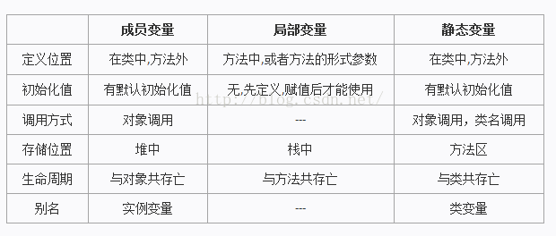

# 类 、 实例（instance） 、 对象（object） 、实例化
面向对象的程序设计中，

- 用类创建对象的过程称为`实例化`；
- 类实例化后的一个`对象`叫做`类`的一个`实例`；
- `对象` = `实例`

如 Date today=new Date()， today变量是由Date类new出来的，这个new的过程称为：类的实例化过程， today变量成为Date类的一个实例。

# 变量

## 类变量

- 也叫静态变量，是一种比较特殊的实例变量，用static关键字修饰；
- 一个类的静态变量，所有由这类生成的对象都共用这个类变量，类装载时就分配存储空间；
- 一个对象修改了变量，则所有对象中这个变量的值都会发生改变；

## 实例变量

- 也叫对象变量、成员变量；
- 从属于类，由类生成对象时，才分配存储空间，各对象间的实例变量互不干扰，能通过对象的引用来访问实例变量；
- 但在Java多线程中，实例变量是多个线程共享资源，要注意同步访问时可能出现的问题；

## 局部变量

- 方法中或者某局部块中声明定义的变量或方法的参数被称为局部变量，
- 他们只存在于创建他们的block里（{}之间）无法在block外进行任何操作，如读取、赋值；
- 在Java多线程中，每个线程都复制一份局部变量，可防止某些同步问题发生；

## 全局变量
包括类变量和成员变量。

## 静态变量
用static关键字修饰的变量。

- 用法上，static是Java的保留关键字，主要是用来限定被修饰对象的使用范围的；
- 可以被用来修饰变量和方法，被修饰的变量成为类变量或静态变量，被修饰的方法被称为类方法或静态方法；区别于成员变量和成员方法；
- 被static修饰的变量和方法可以被类直接使用，而成员变量和成员方法只能被类生成的对象来调用；
- 成员变量和成员方法不能使用由static修饰的变量和方法，即成员变量和成员方法不能调用类变量和类方法；
- 从JVM角度讲，static修饰的代码编译后就确定下来了，而成员变量和成员方法是在运行期动态确定的，所以

# final 作用

1. 修饰类
   1. 表明这个类不能被继承；
   2. 类中的所有成员方法都会被隐式地指定为final方法；
   3. 类中属性的访问权限可以随意设置；
2. 修饰方法
   1. 使用final方法的原因有两个。第一个原因是把方法锁定，以防任何继承类修改它的含义；第二个原因是效率。在早期的Java实现版本中，会将final方法转为内嵌调用。但是如果方法过于庞大，可能看不到内嵌调用带来的任何性能提升。在最近的Java版本中，不需要使用final方法进行这些优化了。因此，如果只有在想明确禁止 该方法在子类中被覆盖的情况下才将方法设置为final的。
   2. 类的private方法会隐式地被指定为final方法。
3. 修饰变量
   1. 如果是基本数据类型的变量，则其数值一旦在初始化之后便不能更改；如果是引用类型的变量，则在对其初始化之后便不能再让其指向另一个对象。
   2. 当用final作用于类的成员变量时，成员变量（注意是类的成员变量，局部变量只需要保证在使用之前被初始化赋值即可）必须在定义时或者构造器中进行初始化赋值，而且final变量一旦被初始化赋值之后，就不能再被赋值了。
   3. static作用于成员变量用来表示只保存一份副本，而final的作用是用来保证变量不可变

# 类的加载机制

1. 类中所有属性的默认值（一举而成）
2. 父类静态属性初始化，静态块，静态方法的声明（按出现顺序执行）
3. 子类静态属性初始化，静态块，静态方法的声明 （按出现顺序执行）
4. 调用父类的构造方法，首先父类的非静态成员初始化，构造块，普通方法的声明（按出现顺序执行）然后父类构造方法。
5. 调用子类的构造方法，首先子类的非静态成员初始化，构造块，普通方法的声明（按出现顺序执行）然后子类构造方法。

内部静态类不会自动初始化，只有调用静态内部类的方法，静态域，或者构造方法的时候才会加载静态内部类。

java遵循“使用时，才加载”的原则。
注意：类的加载过程只发生一次。

1.对于不含静态方法的非抽象类而言，如果你只是创建了一个类的空引用，并没有执行new操作，该类是不会被加载的。也就是说，一个不含静态方法的非抽象类要被加载的话，肯定是在第一次实例化对象时，才会发生类的加载，同时生成实例化对象。但是之后再实例化对象，类的加载过程不会再发生，类的加载过程只发生一次。

2.对于含静态方法的非抽象类而言，第一次执行new操作进行实例化或者调用类方法（即该类的静态方法）时，该类才会被加载的。

3.对于不含静态方法的抽象类而言，只有继承了该类的非抽象子类要被加载时，该不含静态方法的抽象类才会被加载。且抽象父类先加载，非抽象子类后加载。至于非抽象子类什么时候会被加载，见1、2两点。

4.对于含静态方法的抽象类而言，继承了该类的非抽象子类要被加载时或者调用该含静态方法的抽象类的类方法（即该类的静态方法）时，该含静态方法的抽象类才会被加载。

5.接口和不含静态方法的抽象类情况类似，都是只有继承了该接口的非抽象子类要被加载时，该接口才会被加载。应该是父接口先加载，非抽象子类后加载。

上面列了五段话说的绕来绕去的（感觉基础不好的真的会被绕晕，我自己都觉得绕），其实就是为了说明开头的那一段话“java遵循“使用时，才加载”的原则”。通俗点说就是只有用得着某个类或接口的时候，这个类或接口才会被加载，否则就是哪凉快哪待着去。

# 环境常用名词

- DEV(Development environment)
- FAT(Feature Acceptance Test environment)
- UAT(User Acceptance Test environment)
- PRO(Production environment)

# OLTP和OLAP区别
**1、当今的数据处理大致可以分成两大类**：  
联机事务处理On-Line Transaction Processing 
联机分析处理On-Line Analytical Processing
**2、二者特性的不同，决定了对资源需求的偏重**

---

**01-1 OLTP(实时交易库大量短事务对IO要求高)**
**一、面向交易的实时处理系统OLTP** OLTP是传统的[关系型数据库](https://cloud.tencent.com/product/cdb-overview?from_column=20065&from=20065)的主要应用，主要是基本的、日常的事务处理，记录即时的增、删、改、查，比如在银行存取一笔款，就是一个事务交易。 也称为实时系统(Real time System)。衡量联机事务处理系统的一个重要性能指标是系统性能，具体体现为实时响应时间(Response Time)，即用户在终端上送入数据之后，到计算机对这个请求给出答复所需要的时间。
**二、OLTP特点** 1、实时性要求高； OLTP [数据库](https://cloud.tencent.com/solution/database?from_column=20065&from=20065)旨在使事务应用程序仅写入所需的数据，以便尽快处理单个事务。 2、数据量不是很大； 3、交易一般是确定的，所以OLTP是对确定性的数据进行存取(比如存取款都有一个特定的金额)； 4、支持大量并发用户定期添加和修改数据。 并发性要求高并且严格的要求事务的完整、安全性 (比如这种情况：有可能你和你的家人同时在不同银行取同一个帐号的款)。

---

**01-2 OLAP（数据仓库读取分析对CPU要求高）**
所谓数据仓库是对于大量已经由OLTP形成的历史数据加工与分析，读取较多，更新较少的一种分析型的数据库，用于处理商业智能、决策支持等重要的决策信息。
**一、OLAP简介** OLAP即联机分析处理，是数据仓库的核心部心，支持复杂的分析操作，侧重决策支持，并且提供直观易懂的查询结果。典型的应用就是复杂的动态[报表](https://cloud.tencent.com/product/bi?from_column=20065&from=20065)系统。 有兴趣的朋友不妨到科研、教育、文化和卫生系统去看一看，他们那里一般都有一个叫做SPSS(世界上最早的统计分析软件)的统计分析软件，其菜单上有一个“分析”项目，其下拉的第一个项目就是OLAP。 **二、OLAP的特点一般有**：  1、实时性要求不是很高，很多应用顶多是每天更新一下数据； 2、数据量大，因为OLAP支持的是动态查询，所以用户也许要通过将很多数据的统计后才能得到想要知道的信息，例如时间序列分析等等，所以处理的数据量很大； 3、因为重点在于决策支持，所以查询一般是动态的，也就是说允许用户随时提出查询的要求。于是在OLAP中通过一个重要概念“维”来搭建一个动态查询的平台（或技术），供用户自己去决定需要知道什么信息。 **三、主要OLAP厂商产品介绍** 1、Hyperion(已被Oracle收购)EssbaseOLAPServer 2、Cognos(已被Oracle收购) PowerPlay为商务效率评价BPM（BusinessPerformanceMeasurement）提供全面的报告和分析环境。向决策者提供企业运行效率的各种关键数据，进行各种各样的分析。 3、BusinessObjects是易用的BI工具，允许用户存取、分析和共享数据。

---

**01-3 OLTP与OLAP总结一、OLTP与OLAP之间的比较**

**二、特性的不同决定了对资源需求的偏重** OLTP和OLAP的不同，主要通过以下五点区分开来。 1、用户和系统的面向性:
OLTP是面向顾客的,用于事务和查询处理 OLAP是面向市场的,用于数据分析
2、数据内容: OLTP系统管理当前数据 OLAP系统管理大量历史数据,提供汇总和聚集机制
3、访问模式: OLTP系统的访问主要由短的原子事务组成，这种系统需要并行和回滚恢复机制 OLAP系统的访问大部分是只读操作
4、视图: OLTP组织内部的当前数据,不涉及历史数据或不同组织的数据 OLAP则相反.
5、数据库设计: OLTP采用实体-联系ER模型和面向应用的数据库设计. OLAP采用星型或雪花模型和面向主题的数据库设计.

- [OLTP与OLAP的区别精简总结](https://cloud.tencent.com/developer/article/1496132)

