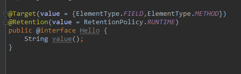
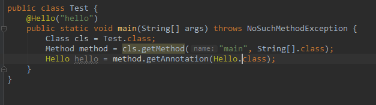

## 1. 背景


JDK 提供了一套完整的代码运行的规范和实现【比如，jvm 中方法区中完成字节码的准备工作，之后在堆中完成引用的链接等，最后在栈上进行运行】，但是有些复杂的业务场景下需要自行控制代码的运行，比如想要完成子类对父类方法的重写，那么就需要在子类的重写方法上做标记，标记“这是对父类方法的重写”，不是别的什么方法，只有这样 jvm 才知道“哦，这是子类的实际应该运行的方法，而不是调用父类的方法”。

针对这种场景，最开始的解决方案是 XML 方式，即在项目中引入 xml 配置文件，在配置文件中做一下标识，然后就可以达到上面说的这种效果。

但随着项目越来越庞大，xml 配置文件变得越来越复杂，维护成本也越来越高，于是，人们又提出注解的配置方式。


## 2. 注解 vs XML

- XML 会随着项目的膨胀，导致维护成本越来越高，效率较低；但这种方式耦合度较低；
- 注解方式耦合度较高，但是效率很高；


## 3. 注解的基本原理

> 补充： .java 元代码文件需要通过编译之后生成 .class 字节码文件，之后 .class 字节码通过加载过程申请运行时的内存空间。
.java 元代码文件 编译 成 .class 字节码文件的过程，称为编译期；
.class 字节码加载到内存空间的过程，称为加载期；
最终内存上的运行过程，称为运行期（runtime）；


- 我们可以把注解理解为： 注解只是一种标识代码实际意义的特殊代码，它强依赖于解析它的代码，如果没有解析它的代码，它可能连自然语言的注释还不如，因此理解注解关键点在于注解的解析代码。
- 解析注解的代码的实现方式有两种，一种是编译期直接扫描，另一种是运行期反射。 
   - 二者的不同在于解析逻辑作用的时机不同。
   - 编译期直接扫描可以理解为，解析代码作用在编译期，即 jdk 会根据注解的实际内容生成实际可运行的 .class 字节码文件；
   - 运行期反射可以理解为，解析代码作用在运行期，利用的是 Java 的反射机制，在运行期调用实际的代码逻辑时，通过生成一个目标注解的代理类，来执行注解代码的解析逻辑；

## 4. 元注解

> 元注解： 描述注解的注解。

- @Target：注解的作用目标，方法上/类上/变量上 
   - 使用：@Target(value  = {ElementType.FIELD}) 
   - ElementType 是一个枚举值： 
      - ElementType.TYPE：允许被修饰的注解作用在类、接口和枚举上
      - ElementType.FIELD：允许作用在属性字段上
      - ElementType.METHOD：允许作用在方法上
      - ElementType.PARAMETER：允许作用在方法参数上
      - ElementType.CONSTRUCTOR：允许作用在构造器上
      - ElementType.LOCAL_VARIABLE：允许作用在本地局部变量上
      - ElementType.ANNOTATION_TYPE：允许作用在注解上
      - ElementType.PACKAGE：允许作用在包上
- @Retention：注解的生命周期，决定使用那种解析方式 
   - 使用： @Retention(value  = RetentionPolicy.RUNTIME) 
   - RetentionPolicy 是一个枚举值： 
      - RetentionPolicy.SOURCE：当前注解编译期可见，解析逻辑不会写入 class 文件
      - RetentionPolicy.CLASS：类加载阶段丢弃，解析逻辑会写入 class 文件
      - RetentionPolicy.RUNTIME：永久保存，解析逻辑可以反射获取
- @Documented：注解是否应当被包含在 JavaDoc 文档中
- @Inherited：是否允许子类继承该注解


### 4.1. JDK 内建注解

- @Override  
- @Deprecated  
- @SuppressWarnings  


### 4.2. 示例

> 「java.lang.annotation.Annotation」接口中有这么一句话，用来描述『注解』。
The common interface extended by all annotation types
所有的注解类型都继承自这个普通的接口（Annotation）。

所以注解的本质就是一个继承了 Annotation 接口的接口。


```markdown
// 这是注解 @Override 的定义，
@Target(ElementType.METHOD)
@Retention(RetentionPolicy.SOURCE)
public @interface Override {

}


// 其实它本质上就是：
public interface Override extends Annotation{
    
}

```








设置一个虚拟机启动参数，用于捕获 JDK 动态代理类。

> -Dsun.misc.ProxyGenerator.saveGeneratedFiles=true


最后我们再总结一下整个反射注解的工作原理：

1.  首先，我们通过键值对的形式可以为注解属性赋值，像这样：@Hello（value = "hello"）。
2. 接着，你用注解修饰某个元素，编译器将在编译期扫描每个类或者方法上的注解，会做一个基本的检查，你的这个注解是否允许作用在当前位置，最后会将注解信息写入元素的属性表。
3. 然后，当你进行反射的时候，虚拟机将所有生命周期在 RUNTIME 的注解取出来放到一个 map 中，并创建一个 AnnotationInvocationHandler 实例，把这个 map 传递给它。
4. 最后，虚拟机将采用 JDK 动态代理机制生成一个目标注解的代理类，并初始化好处理器。

那么这样，一个注解的实例就创建出来了，它本质上就是一个代理类，你应当去理解好 AnnotationInvocationHandler 中 invoke 方法的实现逻辑，这是核心。一句话概括就是，通过方法名返回注解属性值。

## 自定义注解

比如 设置一个 分布式锁 的注解，参考：

[java-eight-part/docs/java/annotation/想自己写框架不会写Java注解可不行.md at master · CoderLeixiaoshuai/java-eight-part](https://github.com/CoderLeixiaoshuai/java-eight-part/blob/master/docs/java/annotation/%E6%83%B3%E8%87%AA%E5%B7%B1%E5%86%99%E6%A1%86%E6%9E%B6%E4%B8%8D%E4%BC%9A%E5%86%99Java%E6%B3%A8%E8%A7%A3%E5%8F%AF%E4%B8%8D%E8%A1%8C.md)

## 5. 参考

[JAVA 注解的基本原理](https://juejin.cn/post/6844903636733001741)


